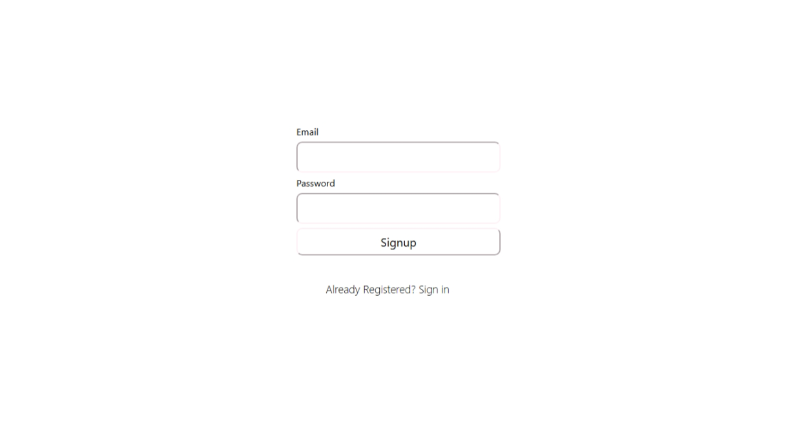

# Signup Form UI

This is a simple **Div Centering Assignment** created using **HTML and CSS**.  
The form is centered using **Flexbox** and includes Email and Password input fields along with a Signup button.

## Technologies Used
- HTML5
- CSS3 (Flexbox, padding, font styling)

## Concepts Covered
- Flexbox centering
- Form structure
- Button font and padding styling
- Basic UI layout

## Preview

## How to Run
Open `index.html` in any web browser.

## Author
Mohammad Sibtain Raza
